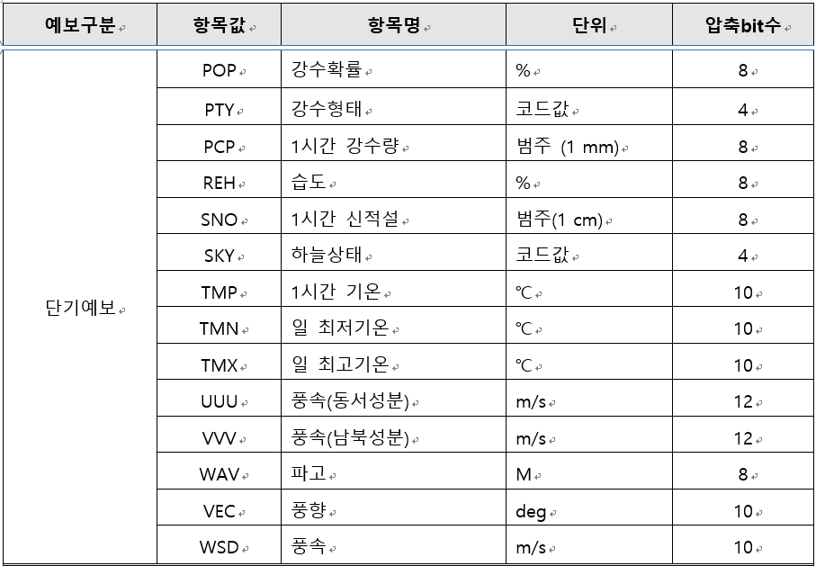
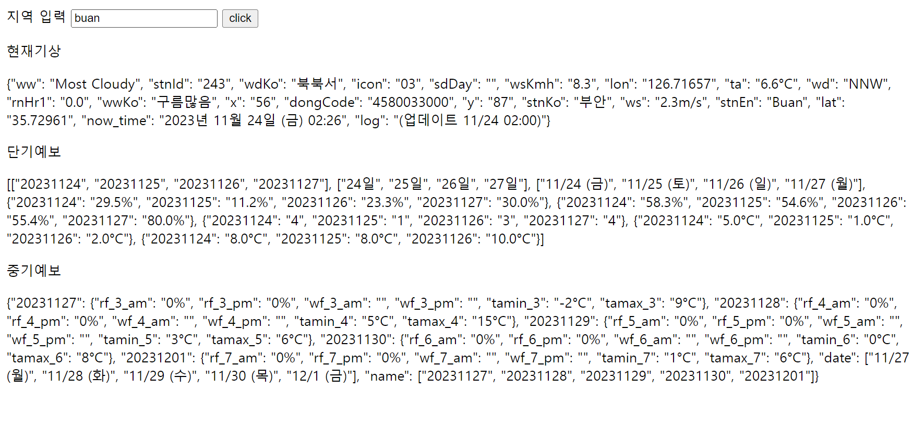

### 지역별 현재 기상, 단기 예보, 중기 예보 API
http://web01.taegon.kr:5000

- 파라미터
~~~~~~~~~~~~~~~~~~~~~~~~~~~
예보 종류 - weather_now : 현재기상 , weather_short : 단기예보, weather_mid : 중기 예보

지역 - 평창, 부안, 남원, 익산 

ex) http://web01.taegon.kr:5000/weather_now/namwon
~~~~~~~~~~~~~~~~~~~~~~~~~~~~~

- 현재기상 : 매시 00분, 30분에 업데이트
- 단기예보 : 일 8회(02:10, 05:10, 08:10, 11:10, 14:10, 17:10, 20:10, 23:10) 업데이트 
- 중기예보 : 일 2회(06시, 18시) 업데이트 

- 현재기상 값 설명

| wwKo | ta  | wdKo | ws  | wsKmh | rnHr1 |
|------|-----|-----|-----|-------|---------|
| 날씨   | 기온  | 풍향  | 풍속  | 시간당풍속 | 시간당강수량 |

- 단기예보 값 설명

- 중기예보 값 설명

| rf_X_am(pm)      | tamin(max)_X   | wf_X_am(pm)    |
|------------------|----------------|----------------|
| X일 후 오전(오후) 강수확률 | X일 후 최저(최고) 기온 | X일 후 오전(오후) 날씨 |

- api 사용 코드 
~~~~~~~~~~~~~~~~~~~~~~~~
import requests
import json
import ast

url = 'http://127.0.0.1:8000/weather_now/namwon'

res = requests.get(url)
data = json.loads(res.content)
result_list = ast.literal_eval(data)
~~~~~~~~~~~~~~~~~~~~~~~~~~~~~~~~~~

